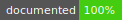

# ShouldAssertions


&nbsp;&nbsp;&nbsp;&nbsp;

[](https://codecov.io/gh/Artees/ShouldAssertions)
[](https://www.codefactor.io/repository/github/artees/shouldassertions)


A BDD library for testing C# code inspired by
[Jasmine](https://jasmine.github.io/),
[Buddy](https://github.com/ciscoheat/buddy), etc.

# Installation
Use [NuGet](https://www.nuget.org/packages/ShouldAssertions/) or [my Unity package registry](https://artees.games/upm).

## Usage
Use the `Artees.Diagnostics.BDD.ShouldExtensions.Should` extension methods for
setting invariants in your code. The assertions will be ignored unless
`SHOULD_ASSERTIONS` is defined as a conditional compilation symbol. The
following code throws a `ShouldException` with the message "Value should be
fascinating but was glorious".
```
#define SHOULD_ASSERTIONS

using Artees.Diagnostics.BDD;

public class ExampleClass
{
    public void Test()
    {
        ShouldAssertions.Listeners.Add(new ExceptionShouldListener());
        const string myCode = "glorious";
        myCode.Should().BeEqual("fascinating");
    }
}
```
Use the `Aka` method to assign a human-readable name to a variable:
```
myCode.Aka("My code").Should().BeEqual("fascinating");
```
The output will be "My code should be fascinating but was glorious".

Currently the `Aka` method  is the only way to add a note, although it doesn't
always look beautiful:
```
myCode.Aka("Oh no! My code").Should().BeEqual("fascinating");
```

Every assertion can be negated using the `Not` method:
```
myCode.Should().Not().BeEqual("fascinating");
```

## Listeners
You can integrate ShouldAssertions with
[Unity's assertions](https://docs.unity3d.com/ScriptReference/Assertions.Assert.html),
[NUnit](http://nunit.org/), or any other testing framework.
Create your listener by inheriting from the `ShouldListener` class:
```
using Artees.Diagnostics.BDD;
using UnityEngine;

public class UnityShouldListener : ShouldListener
{
	public override void LogError(string message)
	{
		Debug.LogAssertion(message);
	}

	public override void LogPending(string message)
	{
		Debug.LogWarning(message);
	}
}
```
Then add the listener to the `ShouldAssertions.Listeners` collection:
```
var listener = new UnityShouldListener();
ShouldAssertions.Listeners.Add(listener);
ShouldAssertions.Fail("Log an assertion message to the Unity's console.");
```
The `ShouldListener` is disposable. When you have finished using it, you should
[dispose](https://docs.microsoft.com/en-us/dotnet/api/system.idisposable#using-an-object-that-implements-idisposable) of it:
```
using (var listener = new UnityShouldListener())
{
	ShouldAssertions.Listeners.Add(listener);
	false.Should().BeTrue();
}
```
or:
```
private void Start()
{
    _listener = new UnityShouldListener();
    ShouldAssertions.Listeners.Add(_listener);
}

private void OnDestroy()
{
    _listener.Dispose();
}
```

## Assertions
| Type              | Example                                      | Description                                                           |
|:----------------- |:-------------------------------------------- | --------------------------------------------------------------------- |
| Any               | `3.Should().BeEqual(3)`                      | Verifies that two values are *equal*.                                 |
| Any               | `true.Should().BeTrue()`                     | Asserts that a condition is *true*.                                   |
| Any               | `false.Should().BeFalse()`                   | Asserts that a condition is *false*.                                  |
| Any               | `((object) null).Should().BeNull()`          | Verifies that the object is equal to `null`.                          |
| Any               | `2.Should().BeInstanceOf<int>()`             | Asserts that the object is an *instance* of a given type.             |
| Any               | `o0.Should().BeSame(o1)`                     | Asserts that two objects refer to the *same* object.                  |
| `double`, `float` | `3.7.Should().BeEqual(3.701, 0.1)`           | Verifies that two values are *equal considering a delta*.             |
| `double`, `float` | `(0.0 / 0.0).Should().BeNaN()`               | Verifies that the value is an `NaN` value.                            |
| `string`          | `"string".Should().Contains("str")`          | Asserts that the *string contains a substring*.                       |
| `IEnumerable`     | `new[] {1, 2, 7}.Should<int>().Contains(7)`  | Asserts that the *collection contains an item*.                       |
| `IComparable`     | `3.Should().BeGreaterThan(2)`                | Verifies that the value is *greater*.                                 |
| `IComparable`     | `3.Should().BeLessThan(4)`                   | Verifies that the value is *less*.                                    |
| `IComparable`     | `3.Should().BeGreaterThanOrEqual(3)`         | Verifies that the value is *greater or equal*.                        |
| `IComparable`     | `3.Should().BeLessThanOrEqual(4)`            | Verifies that the value is *less or equal*.                           |
| `Action`          | `throwException.Should().Throw<Exception>()` | Verifies that a delegate *throws* a particular exception when called. |

## Pending tests
You can write a pending test and come back to it later or let another developer
implement it. The following code logs the warning message "Value should be
fascinating but was glorious".
```
myCode.Should("be fascinating");
```
